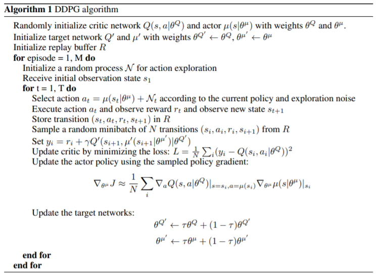
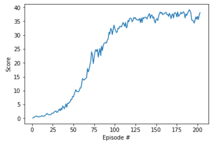

[//]: # (Image References)

[ddpg_image1]: images/ddpg_def.png "DDPG"
[ddpg_image2]: images/ddpg_pseudocode.png "pseudocode"

# Report of the Project 2 - Udacity DRL: Continuous Control

The following is the report corresponding to the project 2 for the Udacity DRL Nanodegree. I am going to divide it into three main parts:

- Learning Algorithm
- Plot of Rewards
- Ideas for Future Work
  
## 1. Learning Algorithm

The algorithm used in this project to solve the [environment](https://s3-us-west-1.amazonaws.com/udacity-drlnd/P2/Reacher/Reacher_Linux.zip) is __DDPG__. For a deeper understanding of this algorithm please read the paper [Continuous Control with Deep Reinforcement Learning](https://arxiv.org/pdf/1509.02971.pdf).

### Deep Deterministic Policy Gradient (DDPG)

One of the typical approaches when solving problems using reinforcement learning (**RL**) is to estimate the optimal action-value function (__q*__) that can be used to obtain the optimal policy (__$\pi$*__) that maps states to actions. This policy tells the agent how to act depending on the current state to get the maximum possible return. This approach is known as **Value-Based Methods**.

However one question arises:

- Why do we have to estimate __q*__ instead of estimating  __$\pi$*__ directly?. 

Well, this is the question that tries to solve the approach known as  **Policy-Based Methods** that uses algorithms like [REINFORCE](https://papers.nips.cc/paper/1713-policy-gradient-methods-for-reinforcement-learning-with-function-approximation.pdf) and Proximal Policy Optimization [PPO](https://arxiv.org/pdf/1707.06347.pdf) to estimate directly __$\pi$*__. Another advantage of using this approach is that we can solve environments with continuous action spaces, unlike **Q-Learning** is no longer limited to discrete action spaces.

Until now, the **Policy-Based Methods** seems to be a great solution if we compare them to the **Value-Based Methods** nevertheless, this approach has a problem. It turns out that when using **Policy-Based Methods** we have a high variance associated with it and therefore low convergence. We need something that reduces the high variance to let the model to converge, to do so we have another approach called **Actor-Critic Methods**.

In the **Actor-Critic Methods** we combine both approaches described before. What we do is to use the **Value-Based Methods** to reduce the variance of the **Policy-Based Methods** introducing some bias in the process. This leads to:
- Get faster learning than policy-based methods.
- Better and more consistent convergence than value-based methods.

**Deep Deterministic Policy Gradient** or [DDPG](https://arxiv.org/pdf/1509.02971.pdf) belongs to the **Actor-Critic Methods**. Here we use two deep neural networks, one for the _actor_ and the other for the _critic_. The _actor_ is used to approximate the maximizer over the Q-values of the next state, it approximates a deterministc policy that predicts the believed best action. The _critic_  learns to evaluate the optmial action value function by using the actors best believed action.

![DDPG][ddpg_image1]

One of the strategies used to make the models converge is **Soft Updates**. Wich consist of slowly blending the regular network weights with the target network weights, in such a way that in every step we make the target network 99.99% of the target network and 0.01% percent of the regular network weights.

### DDPG Pseudocode

### Actor Model Architecture

* The architecture of the model is as follows:
    - __Input Layer__
        -   33 neurons, the same size as the state environment.
    - __Hidden Layers__
        -   400 neurons with __relu__ as the activation function
        -   300 neurons with __relu__ as the activation function
    - __Output Layer__
        -   4 neurons with __relu__ as the activation function, the same size as the action vector of the environment.
    -   __Optimzer__
        -   Adam
    -   __Learning Rate__
        -   1e-4
   
### Critic Model Architecture

* The architecture of the model is as follows:
    - __Input Layer__
        -   33 neurons, the same size as the state environment.
    - __Hidden Layers__
        -   400 neurons with __relu__ as the activation function
        -   300 neurons with __relu__ as the activation function
    - __Output Layer__
        -   1 neurons with __relu__ as the activation function, the value of the action dictated by the actor.
    -   __Optimzer__
        -   Adam
    -   __Learning Rate__
        -   1e-3

### Agent Hyperparameters

As well as **Q-Learning** we need to set the __discount factor &gamma;__ that is the one that defines how much is taking into account the future rewards, so that if it is equal to 0 the agent only considers the immediate reward and the __experience replay__ which is nothing more than a collection of experiences __(S, A, R, S')__. These tuples are gradually added to the buffer of the agent.

* The value of the __discount factor &gamma;__ for this project was set to __0.99__
* The value of the __experience replay__ for this project was set to __1024__ with a __buffer size__ of __1e6__ 

Rememeber that some of the advantages of the use of experience replay are:
 - Breaking harmful correlations. 
 - To learn more from individual tuples multiple times.
 - Recall of rare occurrences, and 
 - In general, make better use of the experience.

Finally, the value of TAU **(&tau;)** for the soft update is equal to __1e-3__.

## 2. Plot of Rewards

The agent run 500 episodes for training, however, it was able to solve the environment after __200 episodes__ accomplishing the goal of, at least, 100 consecutive episodes with a reward of +30. The maximal average score reached for the agent was __+37.86__ during the episode 190. Below you can see a capture of the graph got in training. 

## 3. Ideas for Future Work

Even when the agent solved the environment many possible changes can be done to improve the performance of the agent.

### Try other neural networks architectures for the critic and the actor
The simplest improvement that we can try is varying the number of hidden layers of the models and so the number of neurons of them or to try with different activations functions just like any other neural network.

### Play around with the hyperparameter
We may achieve better performance with a different value for the learning rates, the value of __&gamma;__ or __&tau;__ for the soft update.

### Try other Actor_Critic methods

We may try other algorithm based on the Actor-Critic Approach, as an example, we can try with Distributed Distributional Deterministic Policy Gradients [D4PG](https://openreview.net/pdf?id=SyZipzbCb) which is a very recent algorithm that has shown great performance.

Also, considering that the environment used here has 20 agents built-in we may have a good performance using [PPO](https://arxiv.org/pdf/1707.06347.pdf) or[A3C](https://arxiv.org/pdf/1602.01783.pdf).
